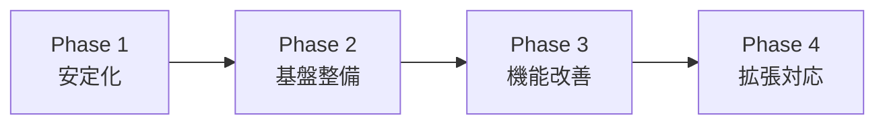

# QuestEd 移行・改善計画書

## 1. 現状分析と課題

### 1.1 現在の技術的問題
- **セキュリティ脆弱性**: XSS、SQLインジェクションリスク
- **パフォーマンス問題**: N+1クエリ、最適化不足
- **コード品質**: 技術的負債、重複コード
- **テスト不足**: カバレッジ不十分、品質保証なし
- **ドキュメント不足**: 仕様書、運用手順なし

### 1.2 ビジネス要件の変化
- **利用者数増加**: 現在50名 → 500名へ拡張予定
- **機能追加要求**: モバイル対応、保護者機能
- **運用要件**: 24時間稼働、99.5%可用性
- **コンプライアンス**: 個人情報保護、セキュリティ基準

## 2. 移行戦略

### 2.1 段階的移行アプローチ


### 2.2 移行原則
1. **無停止移行**: サービス継続性を最優先
2. **段階的実装**: リスク分散
3. **ロールバック対応**: 各段階で戻せる仕組み
4. **データ整合性**: データ損失ゼロ
5. **ユーザー影響最小化**: 操作方法の大幅変更回避

## 3. Phase 1: 緊急安定化（1ヶ月）

### 3.1 セキュリティ脆弱性修正
#### 3.1.1 XSS対策
```python
# Before: 危険な出力
{{ user_input|safe }}

# After: エスケープ処理
{{ user_input|e }}

# Jinja2設定強化
app.jinja_env.autoescape = True
```

#### 3.1.2 SQLインジェクション対策
```python
# Before: 危険な動的クエリ
query = f"SELECT * FROM users WHERE name = '{name}'"

# After: パラメータ化クエリ
query = "SELECT * FROM users WHERE name = %s"
cursor.execute(query, (name,))
```

#### 3.1.3 認証強化
```python
# パスワード要件強化
PASSWORD_MIN_LENGTH = 8
PASSWORD_REQUIRE_SPECIAL = True

# セッション管理改善
app.config['SESSION_COOKIE_SECURE'] = True
app.config['SESSION_COOKIE_HTTPONLY'] = True
```

### 3.2 クリティカルバグ修正
- 4択問題のクリック不具合
- データベース接続エラー
- メール送信失敗
- ファイルアップロードエラー

### 3.3 パフォーマンス緊急対応
```python
# N+1クエリ修正例
# Before
users = User.query.all()
for user in users:
    print(user.school.name)  # N+1発生

# After  
users = User.query.options(joinedload(User.school)).all()
for user in users:
    print(user.school.name)  # 1クエリで解決
```

### 3.4 成果物
- [ ] セキュリティ脆弱性修正完了
- [ ] クリティカルバグ修正完了
- [ ] パフォーマンス改善（レスポンス50%向上）
- [ ] 緊急時対応手順書作成

## 4. Phase 2: 基盤整備（2ヶ月）

### 4.1 テスト環境構築
```python
# pytest設定
# tests/conftest.py
@pytest.fixture
def app():
    app = create_app(TestingConfig)
    with app.app_context():
        db.create_all()
        yield app
        db.drop_all()

@pytest.fixture  
def client(app):
    return app.test_client()
```

### 4.2 CI/CD パイプライン構築
```yaml
# .github/workflows/test.yml
name: Test
on: [push, pull_request]
jobs:
  test:
    runs-on: ubuntu-latest
    steps:
      - uses: actions/checkout@v2
      - name: Set up Python
        uses: actions/setup-python@v2
        with:
          python-version: 3.8
      - name: Install dependencies
        run: pip install -r requirements.txt
      - name: Run tests
        run: pytest --cov=app
      - name: Security scan
        run: bandit -r app/
```

### 4.3 監視・ログ基盤
```python
# 構造化ログ
import structlog

logger = structlog.get_logger()

@app.before_request
def log_request():
    logger.info("request_start", 
                method=request.method,
                path=request.path,
                user_id=getattr(current_user, 'id', None))
```

### 4.4 成果物
- [ ] テストカバレッジ60%達成
- [ ] CI/CDパイプライン稼働
- [ ] 監視・アラート機能
- [ ] 運用手順書完成

## 5. Phase 3: 機能改善（3ヶ月）

### 5.1 アーキテクチャリファクタリング
#### 5.1.1 サービス層導入
```python
# app/services/user_service.py
class UserService:
    @staticmethod
    def create_user(email, password, role):
        # バリデーション
        if not UserService._validate_email(email):
            raise ValidationError("無効なメールアドレス")
        
        # ビジネスロジック
        user = User(email=email, role=role)
        user.set_password(password)
        
        # 永続化
        db.session.add(user)
        db.session.commit()
        
        return user
```

#### 5.1.2 API標準化
```python
# 統一レスポンス形式
class APIResponse:
    def __init__(self, data=None, message=None, status="success"):
        self.data = data
        self.message = message
        self.status = status
        self.timestamp = datetime.utcnow().isoformat()

@api.route('/users')
def get_users():
    users = UserService.get_all_users()
    return jsonify(APIResponse(data=users).to_dict())
```

### 5.2 フロントエンド改善
#### 5.2.1 レスポンシブ対応
```css
/* モバイルファースト */
.choice-item {
    width: 100%;
    margin-bottom: 10px;
}

@media (min-width: 768px) {
    .choice-item {
        width: calc(50% - 10px);
        display: inline-block;
    }
}
```

#### 5.2.2 アクセシビリティ改善
```html
<!-- ARIA属性追加 -->
<div class="choice-item" 
     role="button" 
     tabindex="0"
     aria-label="選択肢1: 答えの内容"
     aria-pressed="false">
```

### 5.3 成果物
- [ ] サービス層完全実装
- [ ] API標準化完了
- [ ] フロントエンド全面改修
- [ ] アクセシビリティ準拠

## 6. Phase 4: 拡張対応（6ヶ月）

### 6.1 マイクロサービス準備
```python
# サービス分離設計
services = {
    'user-service': ['認証', 'ユーザー管理'],
    'learning-service': ['カリキュラム', '学習記録'],
    'ai-service': ['OpenAI統合', '自動評価'],
    'notification-service': ['メール', 'プッシュ通知']
}
```

### 6.2 スケーラビリティ対応
```python
# データベース読み書き分離
class DatabaseConfig:
    SQLALCHEMY_DATABASE_URI = os.environ.get('DB_WRITE_URL')
    SQLALCHEMY_BINDS = {
        'read': os.environ.get('DB_READ_URL')
    }

# 読み取り専用クエリ
users = User.query.options(db.bind_key('read')).all()
```

### 6.3 成果物
- [ ] マイクロサービス基盤
- [ ] 水平スケーリング対応
- [ ] CDN・キャッシュ層
- [ ] 多言語対応基盤

## 7. データ移行計画

### 7.1 移行対象データ
```sql
-- 移行データ量（推定）
SELECT 
    'users' as table_name, COUNT(*) as record_count 
FROM users
UNION ALL
SELECT 'activity_logs', COUNT(*) FROM activity_logs
UNION ALL  
SELECT 'inquiry_themes', COUNT(*) FROM inquiry_themes;
```

### 7.2 移行手順
1. **事前準備**
   - データバックアップ
   - 移行スクリプトテスト
   - ロールバック手順確認

2. **移行実行**
   - メンテナンスモード開始
   - データエクスポート
   - 新環境へインポート
   - 整合性検証

3. **事後確認**
   - 機能テスト実行
   - パフォーマンス確認
   - ユーザー受け入れテスト

### 7.3 リスク対策
- **データ破損対策**: 複数バックアップ保持
- **移行失敗対策**: 即座にロールバック可能
- **ダウンタイム対策**: 最大2時間以内に制限

## 8. 品質保証計画

### 8.1 テスト戦略
```python
# テスト分類
tests = {
    'unit': '各関数・メソッドの単体テスト',
    'integration': 'モジュール間結合テスト', 
    'e2e': 'エンドツーエンドテスト',
    'performance': 'パフォーマンステスト',
    'security': 'セキュリティテスト'
}
```

### 8.2 自動化テスト
```bash
# テスト実行コマンド
pytest tests/unit/          # 単体テスト
pytest tests/integration/   # 結合テスト
selenium tests/e2e/         # E2Eテスト
locust -f tests/load.py     # 負荷テスト
```

### 8.3 コード品質基準
- **テストカバレッジ**: 80%以上
- **セキュリティスコア**: A評価
- **パフォーマンス**: レスポンス3秒以内
- **アクセシビリティ**: WCAG 2.1 AA準拠

## 9. リスク管理

### 9.1 技術リスク
| リスク | 影響度 | 発生確率 | 対策 |
|--------|--------|----------|------|
| データ移行失敗 | 高 | 中 | 複数バックアップ、段階的移行 |
| パフォーマンス劣化 | 中 | 高 | 事前負荷テスト、監視強化 |
| セキュリティ脆弱性 | 高 | 中 | 定期的セキュリティ監査 |

### 9.2 運用リスク  
| リスク | 影響度 | 発生確率 | 対策 |
|--------|--------|----------|------|
| ダウンタイム延長 | 高 | 低 | ロールバック計画整備 |
| ユーザー混乱 | 中 | 中 | 事前説明、トレーニング |
| データ不整合 | 高 | 低 | 厳格な検証手順 |

## 10. 成功指標

### 10.1 技術指標
- **可用性**: 99.5%以上
- **レスポンス時間**: 平均3秒以内
- **エラー率**: 0.1%以下
- **セキュリティ**: 脆弱性ゼロ

### 10.2 ビジネス指標
- **ユーザー満足度**: 4.0/5.0以上
- **システム利用率**: 80%以上
- **問い合わせ件数**: 現在の50%以下
- **機能リクエスト対応**: 30日以内

## 11. スケジュール

### 11.1 全体スケジュール
```
2024年1月: Phase 1 - 緊急安定化
2024年2-3月: Phase 2 - 基盤整備  
2024年4-6月: Phase 3 - 機能改善
2024年7-12月: Phase 4 - 拡張対応
```

### 11.2 マイルストーン
- **1ヶ月後**: セキュリティ脆弱性解決
- **3ヶ月後**: CI/CD・監視基盤完成
- **6ヶ月後**: 新アーキテクチャ移行完了
- **12ヶ月後**: スケーラブルシステム完成

この計画により、QuestEdを安全で拡張可能な本格的な教育プラットフォームに発展させることができます。